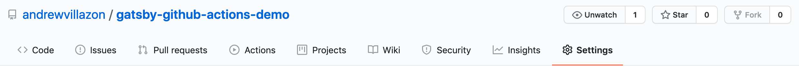

When I built this site a decision I made was taking care of the web hosting myself. The drawback of a DIY approach is you’ve got to do build and deployment yourself.

Recently I discovered Github Actions as a way to automate tasks on a repository and wondered if it would be possible to have Github Actions build and deploy the site for me? A week's worth of tinkering and I managed to establish a process that builds and deploys with every commit to the master branch.

This isn’t a tutorial but something closer to a walk-through of how I setup Github Actions to deploy my site. Hopefully it gives you an idea of what may be possible with your own Gatsby sites.

## What are Github Actions?

Github Actions are a feature of Github that allows the automation of tasks in response to events on a repository. This enables Continous Integration/Continuous Deployment functionality as part of a Github repository.

Before getting into Github Actions here is a brief overview of some of the core ideas.

#### Workflow

A Workflow is a configurable and automated process that can be triggered by an event on the repository. Workflows run inside Github hosted "runners", machines which Github own and maintain. The instructions for a Workflow are described inside a Workflow file.

Workflows break up a process into smaller units called Jobs. A Workflow will consist of one or more Jobs.

#### Jobs

Jobs define a sequence of Steps to be run. Jobs can be run sequentially, in parallel, and can have dependency rules e.g., a Job cannot run without the successful completion of a prior Job. Each Job runs inside its a Virtual Environment inside the Github Runner. Outputs of a Job can be shared between Jobs.

#### Steps

Steps are collections of commands or Actions that perform each "Step" in a Job. Steps can run Actions or terminal commands.

#### Actions

Actions are the lowest grain or unit of Github Actions. They perform very specific tasks in a Workflow such as installing Node.js or uploading files.

Actions come in two flavors: Docker container actions and JavaScript actions.

On the Workflow for this site, I only used Docker container actions. Details for JavaScript actions are found [here](https://docs.github.com/en/actions/creating-actions/creating-a-javascript-action).

When Docker actions are called (invoked) as part of a Workflow, the Github runner automatically builds the Docker container based on the Docker File in the Action's repository. The Action's running environment is the Docker Container.

There are Actions for just about any task you can think of, and most live on Github as public repositories. The catalog of Actions is available through the Github Actions Marketplace.

## A Workflow for Building and Deploying a Gatsby Site

**The repository accompanying this walkthrough is available on [my Github](https://github.com/andrewvillazon/gatsby-github-actions-demo)*

The Docker container(s) that run inside the Github runners are mostly empty. Much of the Workflow involves setting up the environment to enable the building of the Gatsby site and deploying. This means installing Node.js and making sure authentication details are available to use for uploading.

Here is an overview of what the Workflow needs to do:
1. Checkout the code
2. Install project dependencies including the Gatsby CLI
3. Build the site using Gatsby CLI
4. Setup secure uploading
5. Upload the contents of the `./public` folder to a webserver

### Creating the Workflow file

To enable Github Actions on a repository there are two requirements:
1. A directory at the top level (root) of the repository named `.github/workflows`
2. Inside the `.github/workflows` directory a Workflow metadata file stored as `.yml` or `.yaml` (YAML files).

Github will look for any `.yml` or `.yaml` files to see if they contain Workflows regardless of their name.

### Defining the Workflow

The first entry in the file is the name of the Workflow. All Workflows must be named. Following the name is the event that will trigger this Workflow - a push to the master branch.

```yaml
name: Build and Deploy

on:
  push:
    branches: master
```

### Defining a Job

After the Workflow and its trigger is the Jobs definition. Each job is defined as a key and must be unique. The keys that follow configure the job.

```yaml
name: Build and Deploy

on:
  push:
    branches: master
# highlight-start
jobs:
  build-and-deploy:
    name: Build and deploy Gatsby site
    runs-on: ubuntu-latest
    steps: []
# highlight-end
```

The `name` key is optional but is useful to include as it will appear in the Github runner. The `runs-on` key is required and specifies the operating system that the job will run on, the latest version of Ubuntu.

Each Job has a collection of Steps where the specific Actions or tasks are defined.

### Checking out the code

When the Workflow process starts, it's important to check out the repository code so that changes aren't made while the Workflow process is running.

Referencing an Action in a Step involves adding a `uses` key followed by `account/repository-name` as the value. A specific version of the repository can be used by including an `@` symbol and version number.

```yaml
name: Build and Deploy

on:
  push:
    branches: master

jobs:
  build-and-deploy:
    name: Build and deploy Gatsby site
    runs-on: ubuntu-latest
    # highlight-start
    steps:
      - name: Checkout Code
        uses: actions/checkout@v2.3.1
    # highlight-end
```

The Checkout Code Action comes from the official Github Actions account, funnily enough, called "actions". This account provides a range of useful official Actions.

### Installing Node.js

To install project dependancies the Docker container needs to have Node.js which will enable the use of npm. This can be done through the offical action `setup-node`.

```yaml
...

jobs:
  build-and-deploy:
    name: Build and deploy Gatsby site
    runs-on: ubuntu-latest
    steps:
      - name: Checkout Code
        uses: actions/checkout@v2.3.1

      # highlight-start
      - name: Install Node.js
        uses: actions/setup-node@v1
        with:
          node-version: '13.x'
      # highlight-end
```

The `setup-node` Action comes with options to specify a particular version of Node.js to use. Exact versions can be listed, or the latest in a version e.g., `12.x` indicates the newest release of version 12.

Most Actions list the available parameters in their documentation, so it's worth checking the repository to find the available options.

### Installing project dependencies and the Gatsby CLI

When Node.js is installed npm can be used to install the project's dependencies. This step doesn't use an Action but instead uses the `run` keyword to indicate that what follows are terminal commands.

```yaml
...

jobs:
  build-and-deploy:
    name: Build and deploy Gatsby site
    runs-on: ubuntu-latest
    steps:
      - name: Checkout Code
        uses: actions/checkout@v2.3.1
      
      - name: Install Node.js
        uses: actions/setup-node@v1
        with:
          node-version: '13.x'

      # highlight-start
      - name: Install Project Dependencies
        run: npm ci

      - name: Install Gatsby CLI
        run: npm install -g gatsby-cli@2.12.34
      # highlight-end
```

The command `npm ci` (ci for 'clean install') installs the project's dependencies. To run the build process requires the Gatsby CLI. This is included as another Step and uses npm with the command `npm install -g gatsby-cli`.

### Running Gatsby build

With project dependencies and Gatsby CLI installed the build process can run. Once again, this is a terminal command: `gatsby build`.

```yaml
...

jobs:
  build-and-deploy:
    name: Build and deploy Gatsby site
    runs-on: ubuntu-latest
    steps:
      - name: Checkout Code
        uses: actions/checkout@v2.3.1
      
      - name: Install Node.js
        uses: actions/setup-node@v1
        with:
          node-version: '13.x'
      
      - name: Install Project Dependencies
        run: npm ci
      
      - name: Install Gatsby CLI
        run: npm install -g gatsby-cli@2.12.34
      
      # highlight-start
      - name: Build
        run: gatsby build
      
      - name: Verify build
        run: ls -la public
      # highlight-end
```

Following the Build step is a simple directory listing command to verify that the `gatsby build` command generated the site contents.

### Setting up for SFTP

Moving files from the Docker Container to the webserver (host) uses the SSH File Transfer Protocol. SFTP uses SSH to provide secure file transfer.

#### Using Github Secrets

To upload the `./public` directory to the webserver Github runner's environment needs to have access to a collection of authentication details. For security reasons, authentication details shouldn't be stored as plain text inside the Workflow file. On a public repository, this would make them available for anyone to see.

Github provides a secure mechanism for storing sensitive information called "Secrets". Github protects secrets with encryption and is only available to the repository owner. Each repository can store Secrets and reference their values inside the Workflow.

#### Extra security

As an extra security measure I recommend uploading to the webserver with a limited privilege user and not a user with root or superuser (sudo) access. This user should also have SSH key pairs. This user should have access to upload files to a specific directory and not much else. 

If these details are compromised, an attacker may be able to log in but be prevented from doing anything else inside our webserver.

#### Storing authentication details as Secrets

Secrets are located in the " tab of the repository. 



For my Gatsby site Workflow, I store the following as secrets: username, SSH private key, web server's IP address, and the directory on the webserver to upload to (destination).


#### Setting up for SFTP in the Workflow file

To work with SFTP involves getting two things into the Docker Container: The SSH private key to connect to the server (the public key will be on the server), and the keys ensuring connection to the correct server.

Note this time we'll run the Step one command after the other. We can do this by adding the pipe `|` symbol after the `run` key followed by each command on a new line.

```yaml
...

jobs:
  build-and-deploy:
    name: Build and deploy Gatsby site
    runs-on: ubuntu-latest
    steps:
      - name: Checkout Code
        uses: actions/checkout@v2.3.1
      
      - name: Install Node.js
        uses: actions/setup-node@v1
        with:
          node-version: '13.x'
      
      - name: Install Project Dependencies
        run: npm ci
      
      - name: Install Gatsby CLI
        run: npm install -g gatsby-cli@2.12.34
      
      - name: Build
        run: gatsby build
      
      - name: Verify build
        run: ls -la public
      
      # highlight-start
      - name: Setup SSH
        run: |
          mkdir -p ~/.ssh/
          echo "${{ secrets.ssh_private_key }}" > ~/.ssh/deploy_key
          sudo chmod 600 ~/.ssh/deploy_key
          ssh-keyscan -H "${{ secrets.host }}" > ~/.ssh/known_hosts
      # highlight-end
```

To get the private key into the container involves creating an `.ssh` directory and piping the contents of the SSH key secret into a key file. A similar technique is used with the server keys by taking the results of the `ssh-keyscan` command and piping them into the `known-hosts` file.

### Running SFTP commands

After SSH is setup the last step is to construct the command that uploads the contents of the `./public` directory to the webserver.

```yaml
...
      
      - name: Setup SSH
        run: |
          mkdir -p ~/.ssh/
          echo "${{ secrets.ssh_private_key }}" > ~/.ssh/deploy_key
          sudo chmod 600 ~/.ssh/deploy_key
          ssh-keyscan -H "${{ secrets.host }}" > ~/.ssh/known_hosts
      
      # highlight-start
      - name: SFTP upload
        run: sftp -i ~/.ssh/deploy_key ${{ secrets.deploy_user }}@${{ secrets.host }} <<< $'cd ${{ secrets.destination_path }} \n put -r public/*'
```

#### SFTP command in detail

SFTP presents a small problem. Using SFTP on a terminal involves entering commands into an prompt. In the Github runner this isn't possible. Working around this involves issuing the login and upload as one command. Here is a breakdown of the full command:

```shell
sftp -i ~/.ssh/deploy_key ${{ secrets.deploy_user }}@${{ secrets.host }} <<< $'cd ${{ secrets.destination_path }} \n put -r public/*'
```

* The `-i ~/.ssh/deploy_key` tells the command to use the key file created in the previous Step
* `${{ secrets.deploy_user }}@${{ secrets.host }}` constructs the sftp server address out of the username (deploy_user) and webserver (host) ip address, saved as secrets on the repository
* `<<<` indicates a terminal feature called the `here-string`. The `here-string` passes text on its right, in this example a command, to the standard input of the command on the left. This mimics running multiple commands from an SFTP prompt
* `$'cd ${{ secrets.destination_path }} \n put -r public/*'` is the `here-string` input text. Each command is seperated by a new line `\n`. The first command `cd ${{ secrets.destination_path }}` changes directory to where the files should be uploaded to on the webserver. The second command `put -r public/*` uploads the contents of the `public` directory. Using `-r` (recursive option) ensures any sub directories are also created and uploaded.

### Full Workflow file

To finish off here is the workflow file in full:

```yaml
name: Build and Deploy

on:
  push:
    branches: master

jobs:
  build-and-deploy:
    name: Build and deploy Gatsby site
    runs-on: ubuntu-latest
    steps:
      - name: Checkout Code
        uses: actions/checkout@v2.3.1
      
      - name: Install Node.js
        uses: actions/setup-node@v1
        with:
          node-version: '13.x'
      
      - name: Install Project Dependencies
        run: npm ci
      
      - name: Install Gatsby CLI
        run: npm install -g gatsby-cli@2.12.34
      
      - name: Build
        run: gatsby build
      
      - name: Verify build
        run: ls -la public
      
      - name: Setup SSH
        run: |
          mkdir -p ~/.ssh/
          echo "${{ secrets.ssh_private_key }}" > ~/.ssh/deploy_key
          sudo chmod 600 ~/.ssh/deploy_key
          ssh-keyscan -H "${{ secrets.host }}" > ~/.ssh/known_hosts
      
      - name: SFTP upload
        run: sftp -i ~/.ssh/deploy_key ${{ secrets.deploy_user }}@${{ secrets.host }} <<< $'cd ${{ secrets.destination_path }} \n put -r public/*'
```

### Checking the status of the Workflow

Progress of the Workflow is viewed on the Actions Tab of the repository which displays output from the Github Runner. This is also useful for diagnosing issues with the Workflow.


### Conclusion

If you're running a Gatsby site, or a site with a build process, then I recommend experimenting with Github Actions. Hopefully this Workflow has given you a starting point to automate yours.

Lastly a list of the useful links that helped me to create my own Workflow:

* [Workflow syntax for GitHub Actions](https://docs.github.com/en/actions/reference/workflow-syntax-for-github-actions)
* [SFTP-Deploy-Action](https://github.com/wlixcc/SFTP-Deploy-Action)
* [Building and deploying Gatsby sites with GitHub actions](https://nehalist.io/building-and-deploying-gatsby-sites-with-github-actions/)
* [Github actions for Gatsby + firebase hosting](https://gist.github.com/siriwatknp/bd318485d5b0c12049be258997ad0093)
* [Deploying a static website using GitHub Actions](https://salwa.dev/post/deploying-a-static-website-using-github-actions/)
* [Gatsby Github Actions Demo on my Github](https://github.com/andrewvillazon/gatsby-github-actions-demo)