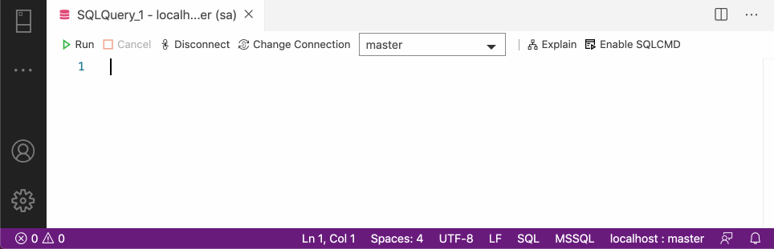
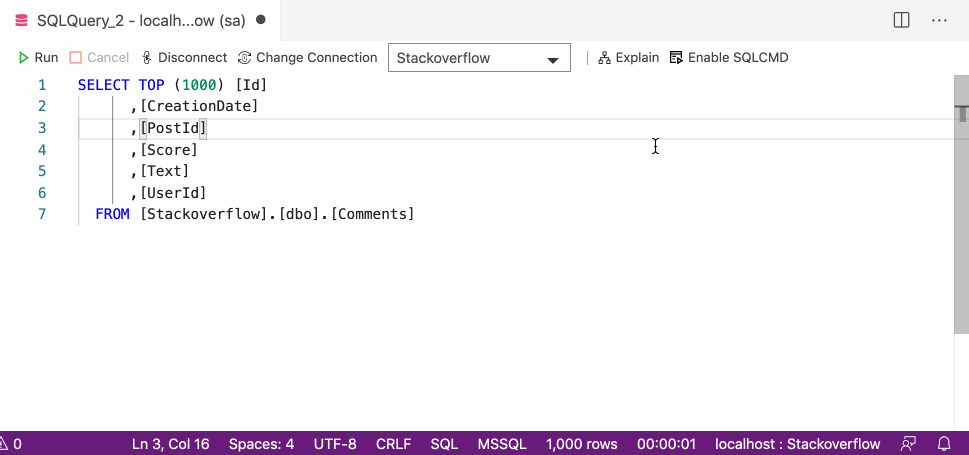
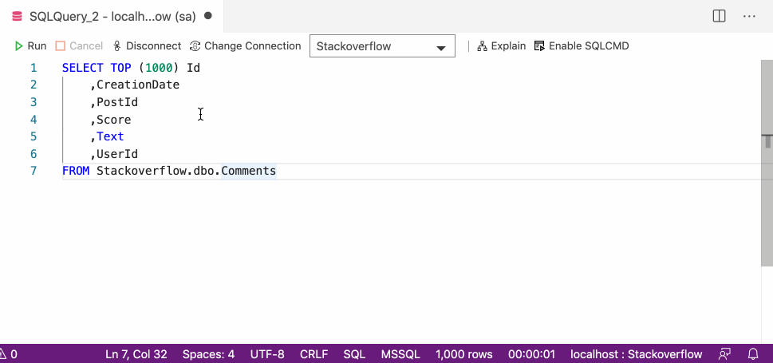
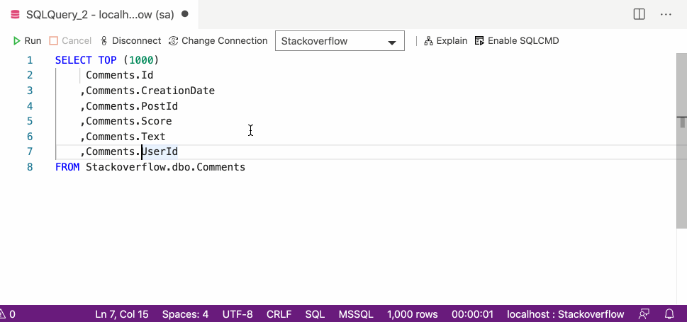
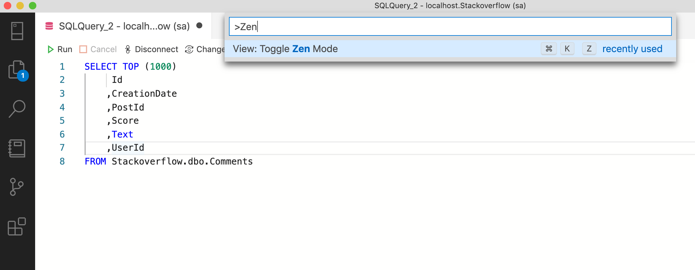
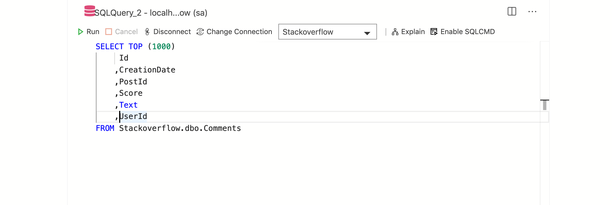
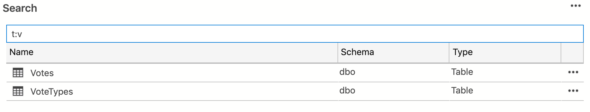

[Azure Data Studio](https://docs.microsoft.com/en-us/sql/azure-data-studio/download-azure-data-studio?view=sql-server-ver15) (**ADS**) has a slew of features that can improve the speed and efficiency of writing **SQL**. Listed below are some of the tips and tricks I've picked up since making the switch from [SQL Server Management Studio](https://docs.microsoft.com/en-us/sql/ssms/download-sql-server-management-studio-ssms?view=sql-server-ver15).

*Prerequisites:*

For this post, I'm going to assume that you're familiar with writing SQL queries and have used a code editor.

## First tip: Become familiar with the Command Palette

The **Command Palette** is the searchable prompt where Azure Data Studio's many commands are accessed. **Commands** do things such as modify your current code, connect to a data source, or change a setting.

To access the Command Palette in Azure Data Studio press:
  * **Windows**: <kbd>ctrl + shift + p</kbd>
  * **Mac**: <kbd>cmd + shift + p</kbd>

The Command Palette is *designed for performing actions from the keyboard*. Familiarising yourself with this tool will help you get a lot more out of Azure Data Studio.

## Quickly comment lines or blocks of code

Comment out the current line:
* **Windows**: <kbd>ctrl + /</kbd>
* **Mac**: <kbd>cmd + /</kbd>

Add a block comment:
* **Windows**: <kbd>alt + shift + a</kbd>
* **Mac**: <kbd>opt + shift + a</kbd>

## Turn a block of code into one line

Got a compact statement that could fit on one line? Use the **Join Lines** command. On Mac, the shortcut for this is <kbd>control + j</kbd>

On Windows, the Join Lines command is **not** bound to a keyboard shortcut but can be set in [Keyboard Shortcuts](https://docs.microsoft.com/en-us/sql/azure-data-studio/keyboard-shortcuts?view=sql-server-ver15#edit-existing-keyboard-shortcuts).

## Hide a region of a query

Want to hide a region of a query, e.g., hide a sub-query while editing the outer query. Try **Code Folding**.

* **Windows**: <kbd>ctrl + shift + [</kbd>, to unfold <kbd>ctrl + shift + ]</kbd>
* **Mac**: <kbd>opt + cmd + [</kbd>, to unfold <kbd>opt + cmd + ]</kbd>

ADS determines a foldable region by evaluating the indentation of lines. A foldable region starts at a line whose next line has a greater indent and ends when the indent is the same as the starting line.

## Search and Replace with Regular Expressions

With a [Regular Expression](https://www.oreilly.com/library/view/introducing-regular-expressions/9781449338879/ch01.html) search and replace, we search for a *text pattern* instead of exact text, which lets you modify more text in one go.

To search and replace:
1. Open the Command Palette and type "replace."
2. Choose the "Replace" command.
3. Set the search to use Regular Expressions.
4. Enter the search pattern and replace as required.

The search and replace below will remove open and closing square brackets from a query in one action (if you, like me, find the square bracket syntax noisy and hard to read).

## Transform to Uppercase or Lowercase

To change:
* Highlight some text
* Bring up the Command Palette (Windows: <kbd>ctrl + shift + p</kbd>, Mac: <kbd>cmd + shift + p</kbd>) and type either **"upper"** or **"lower"**
* Press <kbd>Enter</kbd> to transform.

Transforming the case is even more useful when you combine with **multiple selections**.

Further, the commands can be bound to a [keyboard shortcut](https://docs.microsoft.com/en-us/sql/azure-data-studio/keyboard-shortcuts?view=sql-server-ver15#edit-existing-keyboard-shortcuts) reducing the need to use the Command Palette.

## Change all occurrences of text.

Want to rename something, and in all the places it's used, e.g., rename a variable? Try **Change all occurrences**.

* **Windows**: <kbd>ctrl + f2</kbd>
* **Mac**: <kbd>cmd + f2</kbd>

## Move a line up or down.

We don't need to cut and paste to move a line. This shortcut also works with blocks of selected text.

* **Windows**: <kbd>alt + up</kbd> or <kbd>alt + down</kbd>
* **Mac**: <kbd>opt + up</kbd> or <kbd>opt + down</kbd>

## Copy a line up or down

The same goes for copying a line.

* **Windows**: <kbd>alt + shift + down</kbd> or <kbd>alt + shift + up</kbd>
* **Mac**: <kbd>opt + shift + up</kbd> or <kbd>opt + shift + down</kbd>

## Make many changes at the same time.

If you want to make a change in many places simultaneously, then try **Multiple Cursors**.

To drop multiple cursors into a query is as easy as **holding down** the <kbd>alt</kbd> (Mac: <kbd>opt</kbd>) key and left-clicking with the mouse where you want the additional cursors.

#### Multiple highlighting

This same feature can highlight multiple bits of code. **Holding down** <kbd>alt</kbd> (Mac: <kbd>opt</kbd>) and double-clicking a word will add it to the currently highlighted selection.

#### Box selecting

A variation on this is **Box Selection**, highlighting text in a square or rectangular block. Use Box Selection by **holding down** <kbd>shift + alt</kbd> (Mac: <kbd>shift + opt</kbd>), then holding the left mouse button and drag where you want to highlight.

## Work on one query while referring to another

Try **Side by Side editing**. 

The easiest way to do this in ADS is:
* From the **Explorer sidebar**, drag and drop either a file or Open Editor group to the desired area
* Alternatively, drag and drop an editor tab to the desired area

##### Side by side editing of the same file

Side by Side editing also works for the *same file*, handy when working on a long query spanning greater than the screen height.

This functions just like Side by Side editing, but instead, you **drag the same file** or Open Editor group from the Explorer sidebar onto the desired area.

## Compare differences

Need to see the differences in queries or see what might have changed between two files? Let ADS show you with **Compare differences**.

To compare the differences:

1. From the Explorer sidebar, right-click on the file and click **Select for Compare**
2. From the Explorer sidebar, right-click on the file for comparison and click **Compare with Selected**

## Zen Mode

If you want to focus on a query without the extra distractions of File Menus, notifications, etc., use **Zen Mode**. 

Activate/Deactivate Zen Mode from the Command Palette.

## Auto Save

Turn on **Auto Save**, so you'll never forget to save your work.

Auto Save is disabled by default. To enable:
1. Click the File menu
2. Tick Auto Save

## Get information about a Database Object

Use **Peek Definition** to quickly get information about an Object, such as column names and data types, without leaving the editor and hunting around in the Object Explorer.

To use: 
1. highlight an Object
2. right-click, choose Peek Definition (Windows: <kbd>alt + f12</kbd>, Mac: <kbd>opt + f12</kbd>.

## Find Database Objects fast

Need to search for Database objects quickly? Use the **Database Object Search**.

To access the search:
1. Open the **Connections sidebar**
2. Expand a connection to view all Databases in the connection
3. **Highlight** a Database, right mouse click, and select **Manage**
4. Start typing the object you want to search for.

The search also supports filtering. To filter for a specific type of Database Object (e.g., table, stored procedure), we use the corresponding character followed by a colon. For example, `t:users` will search for all tables containing the text "**users**" in their name.

The following filters are supported:
* `sp:` stored procedure
* `t:` table
* `v:` view
* `f:` function

