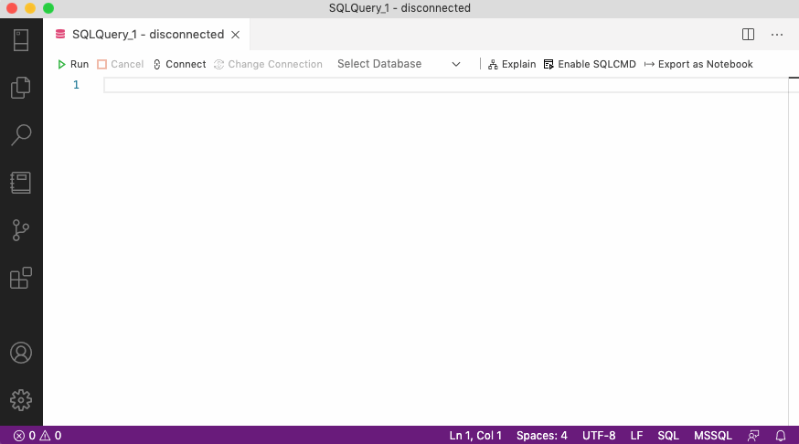
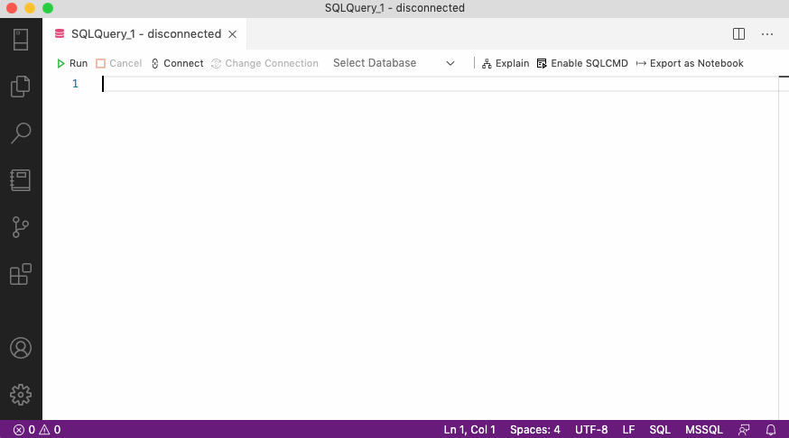
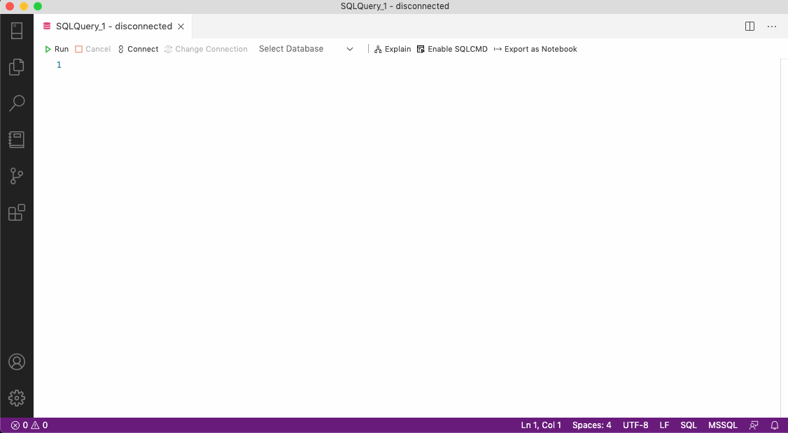

In a [previous post](/auzre-data-studio-tips-tricks/), we looked at various tips and tricks to help you be more productive in Azure Data Studio (ADS).

This post will take that productivity to the next level by exploring **user snippets** in ADS.

## What are user snippets?

User snippets are a feature of modern code editors that insert pre-defined code blocks with a trigger. User snippets let you write repetitive or routine code quicker and easier.

## User Snippets in Azure Data Studio

ADS comes with several default snippets out of the box. You've probably encountered these already while writing queries.

There are two ways to access the default snippets:

#### Access snippets from the text editor

To access the default snippets from the text editor, start typing **"sql"**

When you do this, you should see the list of snippets appear in the **Intellisense**. Pressing <kbd>Tab</kbd> or <kbd>Enter</kbd> will insert that snippet into the text editor. 

You can also press <kbd>ctrl + space</kbd> to see more detail about the snippet.

#### From the Command Palette

Alternatively, you can insert snippets from the **Command Palette**.

Press <kbd>cmd + shift + p</kbd> (Windows: <kbd>ctrl + shift + p</kbd>) to open the Command Palette and then choose **"Insert snippet"** to see the default snippets list.

Let's take a look at creating our own snippets.

## Creating custom user snippets

ADS stores snippets in a **JSON file** for each language. To create a new (or edit existing) snippet file:
1. Press <kbd>ctrl + shift + p</kbd> to open the Command Palette and search for the command **"Preferences: Configure User Snippets"**.
2. Select (or type) **"sql"** from the list of languages and press <kbd>Enter</kbd>.
3. ADS creates a new `sql.json` document with an empty **object** `{}` (curly braces). This object will contain any custom user snippets we define.

    <h4>
    Snippet scope
    </h4>
    

        Snippets are language-specific; for example, you won't see SQL snippets in the Intellisense if you work on a PowerShell script.
    

