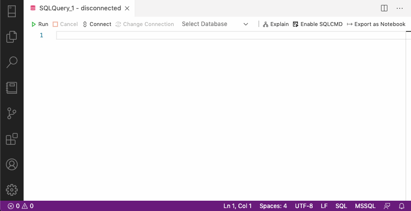
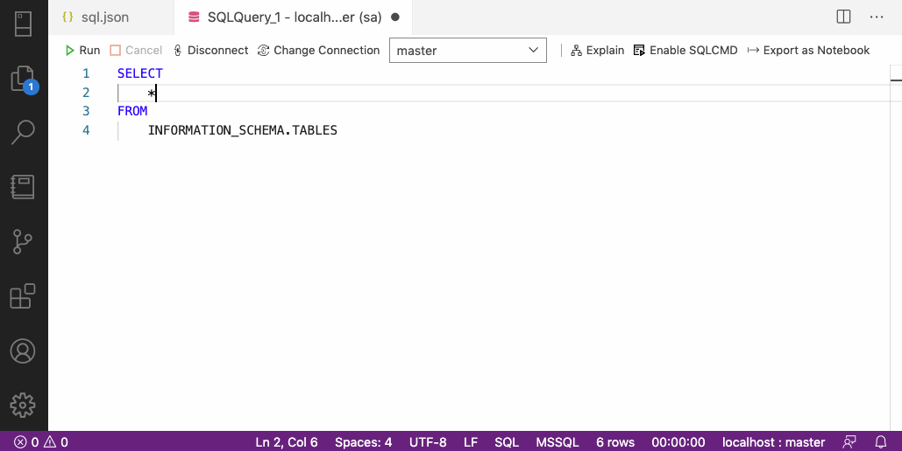
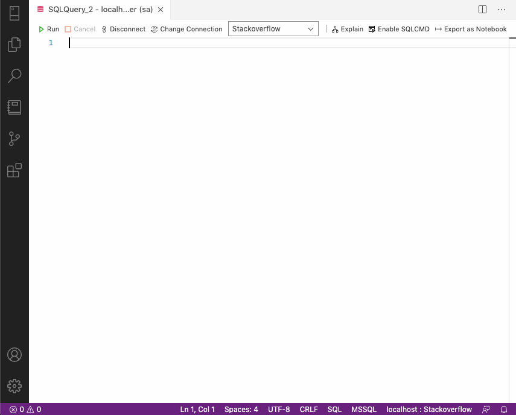
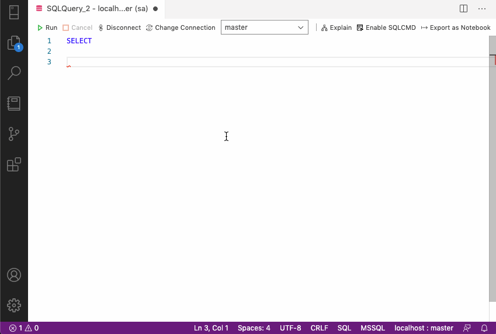

In a [previous post](/auzre-data-studio-tips-tricks/), we looked at various tips and tricks to help you be more productive in Azure Data Studio (ADS).

This post will take that productivity to the next level by exploring **user snippets** in ADS.

## What are user snippets?

User snippets are a feature of modern code editors that insert pre-defined code blocks with a trigger. User snippets let you write repetitive or routine code quicker and easier.

## User Snippets in Azure Data Studio

ADS comes with several default snippets out of the box. You've probably encountered these already while writing queries.

There are two ways to access the default snippets:

#### Access snippets from the text editor

To access the default snippets from the text editor, start typing **"sql"**

When you do this, you should see the list of snippets appear in the **Intellisense**. Pressing <kbd>Tab</kbd> or <kbd>Enter</kbd> will insert that snippet into the text editor. 

You can also press <kbd>ctrl + space</kbd> to see more detail about the snippet.

<p></p>

#### From the Command Palette

Alternatively, you can insert snippets from the **Command Palette**.

Press <kbd>cmd + shift + p</kbd> (Windows: <kbd>ctrl + shift + p</kbd>) to open the Command Palette and then choose **"Insert snippet"** to see the default snippets list.

<p></p>

Let's take a look at creating our own snippets.

## Creating custom user snippets

ADS stores snippets in a **JSON file** for each language. To create a new (or edit existing) snippet file:
1. Press <kbd>ctrl + shift + p</kbd> to open the Command Palette and search for the command **"Preferences: Configure User Snippets"**.
2. Select (or type) **"sql"** from the list of languages and press <kbd>Enter</kbd>.
3. ADS creates a new `sql.json` document with an empty **object** `{}` (curly braces). This object will contain any custom user snippets we define.

<p></p>

<div class="call-out call-out-info">
    <h4>
    Snippet scope
    </h4>
    <p>
        Snippets are language-specific; for example, you won't see SQL snippets in the Intellisense if you work on a PowerShell script.
    </p>
</div>

### Create a new snippet

To create a new snippet, we add a new snippet property and object to the document with the following syntax.

```json
{
    "snippet name": {
        "prefix": "abc",
        "body": [
            "line1", "line2", "etc"
        ],
        "description": "lorem ipsum"
    }
}
```

Snippet objects have the following properties:
* `prefix` - a sequence of text that, when typed, will list the snippet in the Intellisense.
* `body` - a list of the lines of code inserted when the snippet is triggered. Each item in this list represents a new line of code.
* `description` - a short description of the snippet that appears in Intellisense.

To create additional snippets, add more properties and objects separated by a comma.

```json{8}
{
    "snippet one": {
        "prefix": "abc",
        "body": [
            "line1", "line2", "etc"
        ],
        "description": "snippet one description"
    },
    "snippet two": {
        "prefix": "xyz",
        "body": [
            "line1", "line2", "etc"
        ],
        "description": "snippet two description"
    }
}
```

Keep in mind that this is a JSON document, so JSON syntax and rules apply.

### But wait, there's more - Snippet features

User snippets have particular constructs that can enhance the usefulness of the snippet.

#### Tabstops

Tabstops are cursor locations that you can place inside the body of a snippet. Each Tabstop includes a number indicating the order in which the cursor will be moved when pressing <kbd>tab</kbd>.

The syntax for a Tabstop is: `$cursor_number`

e.g., `$1`, `$2`, etc., with `$0` indicating the cursor's final position.

Multiple occurrences of the same Tabstop number will be highlighted and updated together.

```json{5-7}
{
    "Declare and set": {
        "prefix": "dec",
        "body": [
            "DECLARE @$1 $2",
            "SET @$1 = $3",
            "$0"
        ],
        "description": "Declares and sets a variable."
        }
}
```

<p></p>

#### Placeholders

Placeholders are **Tabstops** with default values: `${number:default}` e.g., `${1:MAX}`, `${1:GETDATE()}`

```json{5}
{
    "Declare varchar": {
        "prefix": "decv",
        "body": [
            "DECLARE @${1:name} VARCHAR(${2:MAX})",
            "$0"
        ],
        "description": "DECLARE VARCHAR with default max"
    }
}
```

<p></p>

#### Choices

These are placeholders with a *list* of options instead of default text. Options are placed in between two pipe-characters ("|") and separated by a comma: `${number|opt_one,opt_two,opt_three|}`

When you call the snippet, the options will appear as a drop-down of selectable values.

```json
{
    "DATENAME choices": {
        "prefix": "dn",
        "body": [
            "DATENAME (${1|DAY,WEEK,MONTH,YEAR|}, ${2:date})$0",
        ],
        "description": "DATENAME function with datepart as choices"
    }
}
```

<p></p>

#### Variables

User Snippets can include unique variables such as file or current time information. Like Tabstops, they are specified with a `$` (dollar sign) e.g. `$TM_FILENAME`

```json
{
    "Dated line comment": {
        "prefix": "lcd",
        "body": [
            "$LINE_COMMENT $CURRENT_YEAR-$CURRENT_MONTH-$CURRENT_DATE ${1:comment}$0",
        ],
        "description": "Line comment prefixed with current date"
    }
}
```

<p></p>

Available variables:
* `$TM_SELECTED_TEXT`: Selected text or an empty string if nothing selected
* `$TM_CURRENT_LINE`: Everything in the current line
* `$TM_CURRENT_WORD`: Contents of the word under the cursor or an empty string
* `$TM_LINE_INDEX`: Index number of the line starting at 0
* `$TM_LINE_NUMBER`: Index number of the line starting at 1
* `$CLIPBOARD`: Contents of the clipboard
* `$TM_FILENAME`: Filename of the current document
* `$TM_FILENAME_BASE`: The filename of the current file without the file extension
* `$TM_FILEPATH`: Full file path of the current file
* `$TM_DIRECTORY`: Directory name of the current file
* `$WORKSPACE_NAME`: Name of the opened workspace or folder
* `$CURRENT_YEAR`: Current year
* `$CURRENT_YEAR_SHORT`: Current year's last two digits, e.g., 20
* `$CURRENT_MONTH`: Current month as two digits, e.g., 02
* `$CURRENT_MONTH_NAME`: Full name of the current month, e.g., December
* `$CURRENT_MONTH_NAME_SHORT`: Shortened form of the month name
* `$CURRENT_DATE`: Day of the month
* `$CURRENT_DAY_NAME`: Weekday name, e.g., Tuesday
* `$CURRENT_DAY_NAME_SHORT`: Short weekday name, e.g., Tue
* `$CURRENT_HOUR`: Hour of the current time (24-hour clock)
* `$CURRENT_MINUTE`: Minute of the current time
* `$CURRENT_SECOND`: Second of the current time
* `$CURRENT_SECONDS_UNIX`: Number of seconds since the Unix epoch
* `$BLOCK_COMMENT_START`: Block comment start in the language of the file
* `$BLOCK_COMMENT_END`: Block comment end in the language of the file
* `$LINE_COMMENT`: Line comment in the language of the file

#### Add indents with the tab escape character

It's also possible to add some basic formatting with the `\t` tab escape character. This lets you apply your SQL style to the snippet.

```json{6-9, 11-11}
{
    "List all tables": {
        "prefix": "tables",
        "body": [
            "SELECT",
            "\tTABLE_CATALOG",
            "\t,TABLE_SCHEMA",
            "\t,TABLE_NAME",
            "\t,TABLE_TYPE",
            "FROM",
            "\tINFORMATION_SCHEMA.TABLES"
        ],
        "description": "List all tables for the current database"
    }
}
```

## Examples

Here is a selection of snippets I regularly use to give you an idea of what you can do.

#### LIKE operator with wildcards

This snippet inserts a `LIKE` operator with two percent `%` wildcards and the cursor placed between them.

```json
{
    "Like with wildcards": {
        "prefix": "ll",
        "body": [
            "LIKE '%${1:pattern}%'$0"
        ],
        "description": "LIKE operator with two wildcards and cursor in middle"
    }
}
```

#### DATEDIFF with choices

With this snippet, we include (most of) the available date part options in the `DATEDIFF` function. This snippet saves hunting around online for the date part we need.

```json
{
    "DATEDIFF options": {
        "prefix": "dd",
        "body": [
            "${0:,}DATEDIFF(${1|SECOND,MINUTE,HOUR,DAY,WEEK,MONTH,YEAR|}, ${2:start}, ${3:end})"
        ],
        "description":"DATEDIFF with selectable dateparts"
    }
}
```

The same idea works with other functions such as `DATEADD` or `DATEPART`.

#### Comment header or banner

If I'm working on a large query with different sections, I find it useful to add a header or banner. This snippet helps ensure my headings are consistent each time.

```json
{
    "Section header comment": {
        "prefix": "header",
        "body": [
            "$BLOCK_COMMENT_START ===============================================================",
            "${1:section title}",
            "=============================================================== $BLOCK_COMMENT_END",
            "$0",
        ],
        "description": "Header for a section or block of code"
    }
}
```

## Whole queries

Lastly, snippets aren't just limited to small code blocks. You can use them to insert partial or complete queries with tables, joins, and columns specific to your database.

Capturing whole queries, joins, or clusters of columns as snippets can speed up writing ad-hoc, repetitive queries.

Below a whole query is inserted with a snippet call. 

<p></p>

Similarly, below, snippet calls insert joins and columns to help generate an ad-hoc query.

<p></p>

However, if you work with a database schema that is continually changing, it can become problematic to keep these types of snippets up to date.

## Conclusion

The utility of user snippets comes from quickly inserting code and the ability to customize them to your particular database(s). As we've seen, snippets are a useful tool that takes the hassle out of repetitive code.

Investing time in snippets pays off with improved productivity. Hopefully, this article has got you thinking about developing your own snippets!