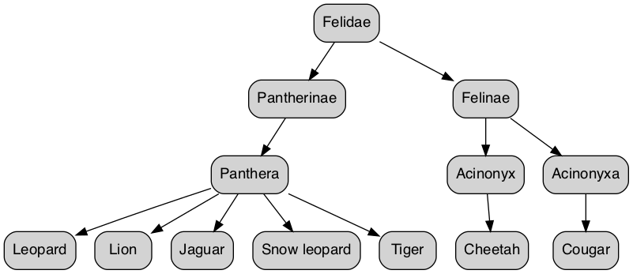

One of the more interesting features of [Common Table Expressions (CTEs)](https://docs.microsoft.com/en-us/sql/t-sql/queries/with-common-table-expression-transact-sql?view=sql-server-ver16) is their ability to refer to themselves. This ability allows the CTE to perform something called **Recursion**, and in this post, we'll look at how to build Recursive CTEs in T-SQL and situations where you might use Recursive CTEs.

For this post, I will assume that you're already familiar with Common Table Expressions and are comfortable using them in a query. If you're not but want to learn more, I highly recommend [Itzik Ben-Gan's exploration of CTEs](https://sqlperformance.com/2020/04/t-sql-queries/table-expressions-part-1).

## What is Recursion?

In programming, Recursion is a technique used to solve problems by breaking them into **smaller and smaller sub-tasks of the same type**. Recursion is typically understood as a function that calls itself until a condition is met.

Recursion works well on certain problems, particularly involving hierarchical data (think tree-style structures) or where a problem naturally suits being broken into sub-problems.

## Recursive CTEs

SQL Server implements Recursion through Recursive CTEs, a unique type of CTE that references itself.

### Structure and layout

A Recursive CTE has three components:

* **Anchor Query:** Think of this as the starting point for the query. The anchor provides the initial result set.
* **Recursive Query:** Following the anchor query, the Recursive query runs iteratively until a condition is met. The result set from each iteration serves as input into the next.
* **Break Condition (optional):** Also called the **Termination Condition**. The predicate or condition that stops any further iteration.

Recursive CTEs have the following layout:

```sql
WITH recursive_cte(list_of_col_names) AS (
    
    anchor_query

    UNION ALL

    recursive_query

    WHERE
    
    break_condition
)
SELECT
    columns
FROM
    recursive_cte
```

## Writing a Recursive CTE

Now that you know more about Recursion and Recursive CTE requirements let's write a Recursive CTE for hierarchical data.

### Data

We'll work off the data below, stored in a temp table so you can run it without a physical table.

```sql
DROP TABLE IF EXISTS #cats
CREATE TABLE #cats (
    cat_id INT
    ,cat VARCHAR(20)
    ,ancestor_id INT
)

INSERT INTO #cats(cat_id, cat, ancestor_id)
VALUES
(1,'Felidae', NULL)
,(2,'Pantherinae', 1)
,(3,'Felinae', 1)
,(4,'Panthera', 2)
,(5,'Acinonyx', 3)
,(6,'Acinonyxa', 3)
,(7,'Leopard', 4)
,(8,'Lion', 4)
,(9,'Jaguar', 4)
,(10,'Snow leopard', 4)
,(11,'Tiger', 4)
,(12,'Cheetah', 5)
,(13,'Cougar', 6);
```

There are a couple of features of this data to pay attention to:

* The data represents the relationships between an organism and its common ancestors (known as a [Cladogram](https://www.thoughtco.com/cladogram-definition-and-examples-4778452)). Each row is a family tree member, and the rows relate to each other.
* The data has a hierarchy, so there will be a row(s) that represents the top of the hierarchy. These rows *do not* have an ancestor.

If visualized, the data might look something like this.

<p></p>

Let's create a Recursive CTE to traverse and query this data.

### Anchor Query

The first step in a Recursive CTE is creating the Anchor Query. In the Anchor Query, we select the first level of the hierarchy, i.e., the rows that don't have an ancestor.

You can think of the Anchor Query as the starting point for our iterative query.

```sql{13,14}
WITH 
    recursive_cte AS 
    (
        SELECT
            #cats.cat_id
            ,#cats.cat
            ,#cats.ancestor_id
            ,CAST(NULL AS VARCHAR(20)) as ancestor
            ,0 as level
            ,CAST(#cats.cat as VARCHAR(MAX)) as lineage
        FROM
            #cats
        WHERE
            ancestor_id IS NULL
    )
```

### Recursive query

Next comes the Recursive Query, where the CTE will reference itself.

```sql{27,28}
WITH 
    recursive_cte AS 
    (
        SELECT
            #cats.cat_id
            ,#cats.cat
            ,#cats.ancestor_id
            ,CAST(NULL AS VARCHAR(20)) as ancestor
            ,0 as level
            ,CAST(#cats.cat as VARCHAR(MAX)) as lineage
        FROM
            #cats
        WHERE
            ancestor_id IS NULL
        
        UNION ALL

        SELECT
            #cats.cat_id
            ,#cats.cat
            ,#cats.ancestor_id
            ,recursive_cte.cat
            ,level + 1
            ,recursive_cte.lineage + ' > ' + #cats.cat
        FROM
            #cats
                INNER JOIN recursive_cte
                    ON recursive_cte.cat_id = #cats.ancestor_id
    )
```

It's important to note the `INNER JOIN`, which references `recursive_cte`. The join steps the query into the next level of the hierarchy because the Recursive Query returns only rows that match the `ancestor_id` from the previous Anchor Query.

And lastly, as with a regular CTE, we query the CTE with a `SELECT`.

```sql
WITH 
    recursive_cte AS 
    (
        SELECT
            #cats.cat_id
            ,#cats.cat
            ,#cats.ancestor_id
            ,CAST(NULL AS VARCHAR(20)) as ancestor
            ,0 as level
            ,CAST(#cats.cat as VARCHAR(MAX)) as lineage
        FROM
            #cats
        WHERE
            ancestor_id IS NULL
        
        UNION ALL

        SELECT
            #cats.cat_id
            ,#cats.cat
            ,#cats.ancestor_id
            ,recursive_cte.cat
            ,level + 1
            ,recursive_cte.lineage + ' > ' + #cats.cat
        FROM
            #cats
                INNER JOIN recursive_cte
                    ON recursive_cte.cat_id = #cats.ancestor_id
    )
SELECT
    cat_id
    ,cat
    ,ancestor_id
    ,ancestor
    ,recursive_cte.level
    ,recursive_cte.lineage
FROM
    recursive_cte
```

### What about a Break Condition?

As mentioned above, the Break Condition is the 3rd and optional component of a Recursive CTE. The Break Condition tells the query when to stop the Recursive iteration.

In the case of hierarchical data, we don't need a Break Condition, as SQL Server will continue down the hierarchy until it reaches the end.

### How it works

There are a couple of key ideas to understanding how SQL Server processes the Recursive CTE:

* The result set gets built **recursively**, i.e., step by step.
* At each recursion, only the result set of the previous step is available to the Recursive Query, not the accumulating result set.

Let's look at how the result set gets built up as the query steps through the data.

#### Initial query

The query begins with the Anchor, which returns all rows without an ancestor, i.e., the top of the hierarchy.

```sql
-- Anchor Query
SELECT
    #cats.cat_id
    ,#cats.cat
    ,#cats.ancestor_id
    ,CAST(NULL AS VARCHAR(20)) as ancestor
    ,0 as level
    ,CAST(#cats.cat as VARCHAR(MAX)) as lineage
FROM
    #cats
WHERE
    ancestor_id IS NULL
```

At this iteration, the `result` set of `recursive_cte` looks like this.

```
| cat_id | cat     | ancestor_id | ancestor | level | lineage |
|--------|---------|-------------|----------|-------|---------|
| 1      | Felidae | NULL        | NULL     | 0     | Felidae |
```

#### Recursion 1

After this, the Recursion starts, and the query engine repeatedly runs the Recursive Query.

`recursive_cte` is joined to the original data. The effect of this is a result set of descendants of rows from the previous step.

```sql{13,14}
-- Recursive query
UNION ALL

SELECT
    #cats.cat_id
    ,#cats.cat
    ,#cats.ancestor_id
    ,recursive_cte.cat
    ,level + 1
    ,recursive_cte.lineage + ' > ' + #cats.cat
FROM
    #cats
        INNER JOIN recursive_cte
            ON recursive_cte.cat_id = #cats.ancestor_id
```

The result set of `recursive_cte` now looks like this.

```
| cat_id | cat         | ancestor_id | ancestor | level | lineage               |
|--------|-------------|-------------|----------|-------|-----------------------|
| 2      | Pantherinae | 1           | Felidae  | 1     | Felidae > Pantherinae |
| 3      | Felinae     | 1           | Felidae  | 1     | Felidae > Felinae     |
```

#### Recursion 2

The Recursive Query repeats and the result set of the previous step is joined back to the original data, which takes us into the next level of the hierarchy.

The result set of `recursive_cte` now looks like this.

```
| cat_id | cat       | ancestor_id | ancestor    | level | lineage                          |
|--------|-----------|-------------|-------------|-------|----------------------------------|
| 5      | Acinonyx  | 3           | Felinae     | 2     | Felidae > Felinae > Acinonyx     |
| 6      | Acinonyxa | 3           | Felinae     | 2     | Felidae > Felinae > Acinonyxa    |
| 4      | Panthera  | 2           | Pantherinae | 2     | Felidae > Pantherinae > Panthera |
```

#### The last Recursion

The Recursive Query repeats once more, stepping into the last level of the hierarchy.

```
| cat_id | cat          | ancestor_id | ancestor  | level | lineage                                         |
|--------|--------------|-------------|-----------|-------|-------------------------------------------------|
| 13     | Cougar       | 6           | Acinonyxa | 3     | Felidae > Felinae > Acinonyxa > Cougar          |
| 12     | Cheetah      | 5           | Acinonyx  | 3     | Felidae > Felinae > Acinonyx > Cheetah          |
| 7      | Leopard      | 4           | Panthera  | 3     | Felidae > Pantherinae > Panthera > Leopard      |
| 8      | Lion         | 4           | Panthera  | 3     | Felidae > Pantherinae > Panthera > Lion         |
| 9      | Jaguar       | 4           | Panthera  | 3     | Felidae > Pantherinae > Panthera > Jaguar       |
| 10     | Snow leopard | 4           | Panthera  | 3     | Felidae > Pantherinae > Panthera > Snow leopard |
| 11     | Tiger        | 4           | Panthera  | 3     | Felidae > Pantherinae > Panthera > Tiger        |
```

At this point, the query has reached the bottom of the hierarchy, where no more rows exist, and returns the accumulated result set.

```
| cat_id | cat          | ancestor_id | ancestor    | level | lineage                                         |
|--------|--------------|-------------|-------------|-------|-------------------------------------------------|
| 1      | Felidae      | NULL        | NULL        | 0     | Felidae                                         |
| 2      | Pantherinae  | 1           | Felidae     | 1     | Felidae > Pantherinae                           |
| 3      | Felinae      | 1           | Felidae     | 1     | Felidae > Felinae                               |
| 5      | Acinonyx     | 3           | Felinae     | 2     | Felidae > Felinae > Acinonyx                    |
| 6      | Acinonyxa    | 3           | Felinae     | 2     | Felidae > Felinae > Acinonyxa                   |
| 13     | Cougar       | 6           | Acinonyxa   | 3     | Felidae > Felinae > Acinonyxa > Cougar          |
| 12     | Cheetah      | 5           | Acinonyx    | 3     | Felidae > Felinae > Acinonyx > Cheetah          |
| 4      | Panthera     | 2           | Pantherinae | 2     | Felidae > Pantherinae > Panthera                |
| 7      | Leopard      | 4           | Panthera    | 3     | Felidae > Pantherinae > Panthera > Leopard      |
| 8      | Lion         | 4           | Panthera    | 3     | Felidae > Pantherinae > Panthera > Lion         |
| 9      | Jaguar       | 4           | Panthera    | 3     | Felidae > Pantherinae > Panthera > Jaguar       |
| 10     | Snow leopard | 4           | Panthera    | 3     | Felidae > Pantherinae > Panthera > Snow leopard |
| 11     | Tiger        | 4           | Panthera    | 3     | Felidae > Pantherinae > Panthera > Tiger        |
```

A closer look at the level and lineage columns indicates how SQL Server traversed the hierarchy.

It began with the root of the hierarchy, then traveled down to the Felidae branch before returning and traveling down Pantherinae.

## Recursion Limit Error

Due to the potential for Recursive CTEs to run indefinitely, SQL Server has protections that limit how many times it runs the Recursive query. SQL Server sets the default Recursion Limit to **100**, i.e., 100 Recursive Query calls.

To modify this, we can include the `OPTION` clause with the `MAXRECURSION` option. The `MAXRECURSION` option takes a number specifying how many calls of the Recursive query to allow.

Setting `MAXRECURSION` to `0` allows indefinite recursions or as many recursions as required to complete the query.

```sql{18}
WITH recursive_cte(list_of_col_names) AS (
    
    anchor_query

    UNION ALL

    recursive_query

    WHERE
    
    break_condition
)
SELECT
    columns
FROM
    recursive_cte

OPTION (MAXRECURSION 0)
```

When dealing with Recursion, it's a good idea to consider using a Break Condition or setting a limit to an expected value. For example, using Recursion to generate a result set of days in a year (see below), you might set the `MAXRECURSION` to `365`.

Setting a limit on the Recursion helps protect against unexpected behavior due to data changing.

## Other uses for Recursive CTEs

Apart from hierarchical data, Recursive CTEs have a couple of other uses.

### Generating a sequence with Recursive CTEs

Recursive CTEs can be used to generate a sequence of values.

Here the Anchor Query sets the starting value, and each call of the Recursive Query adds to the iteration before it.

```sql{12}
WITH recursive_sequence(sequence_num) AS (
    SELECT
        0
    
    UNION ALL

    SELECT
        recursive_sequence.sequence_num + 1
    FROM 
        recursive_sequence
    WHERE
        (recursive_sequence.sequence_num + 1) < 10
)
SELECT
    recursive_sequence.sequence_num
FROM
    recursive_sequence
```

Notice that we included a Termination Condition in the Recursive Query of the CTE. The Termination Condition tells the Recursive CTE when to stop; without this, the query would continue repeating until hitting the max recursion limit (see above).

Here we apply the same idea to create a simple calendar using a Recursive CTE and the `DATEADD` function.

```sql{13,19}
DECLARE @calendar_start DATE = '2022-01-01'
DECLARE @calendar_end DATE = DATEADD(YEAR, 1, @calendar_start);

WITH calendar(calendar_date, calendar_month, calendar_weekday) AS (
    SELECT
        @calendar_start
        ,DATENAME(MONTH, @calendar_start)
        ,DATENAME(WEEKDAY, @calendar_start)
    
    UNION ALL
    
    SELECT
        DATEADD(DAY, 1, calendar_date)
        ,DATENAME(MONTH, DATEADD(DAY, 1, calendar_date))
        ,DATENAME(WEEKDAY, DATEADD(DAY, 1, calendar_date))
    FROM
        calendar
    WHERE
        calendar_date < @calendar_end
)
SELECT
    *
FROM
    calendar
OPTION (MAXRECURSION 0)
```

### Use Recursive CTEs to generate rows from aggregated data

A variation on generating a sequence, we can use Recursive CTEs to generate rows from summarized data. The summarized data needs to include a number column for this to work.

```sql
-- Setup data
DECLARE @summary TABLE (
    fruit VARCHAR(10)
    ,is_preferred CHAR
    ,total INT
)
INSERT INTO @summary(fruit, is_preferred, total)
VALUES
('Banana', 'Y', 2)
,('Banana', 'N', 3)
,('Orange', 'Y', 1)
,('Orange', 'N', 0)
,('Mango', 'Y', 4)
,('Mango', 'N', 1);

-- Setup break point, i.e., stop the sequence after this many rows
DECLARE @break_point INT = (SELECT MAX(total) FROM @summary);

-- Generate sequence of rows, stopping at the break point
WITH sequence_cte(sequence_num) AS (
    -- Anchor query
    SELECT
        1
    
    UNION ALL

    -- Recursive query
    SELECT
        sequence_num + 1
    FROM
        sequence_cte
    WHERE
        sequence_cte.sequence_num < @break_point
)

-- Produce disaggregated result set
SELECT
    summary.fruit
    ,summary.is_preferred
FROM
    @summary as summary
        INNER JOIN sequence_cte
            ON sequence_cte.sequence_num <= summary.total
ORDER BY
    summary.fruit
    ,summary.is_preferred DESC
    ,sequence_cte.sequence_num;
```

First, we use a Recursive CTE to generate a sequence of values (see above) up to the largest number in our summarized data.

```sql{1,14}
DECLARE @break_point INT = (SELECT MAX(total) FROM @summary);

WITH sequence_cte(sequence_num) AS (
    SELECT
        1
    
    UNION ALL

    SELECT
        sequence_num + 1
    FROM
        sequence_cte
    WHERE
        sequence_cte.sequence_num < @break_point
)
```

Then, to generate the rows, we join the sequence of values back to the original summarized data. Note the join condition which causes this to happen.

```sql{7}
SELECT
    summary.fruit
    ,summary.is_preferred
FROM
    @summary as summary
        INNER JOIN sequence_cte
            ON sequence_cte.sequence_num <= summary.total
```

### Separate delimited values into rows with a Recursive CTE

*Note that this functionality is available from SQL Server 2016 onwards via the `STRING_SPLIT()` [function](/sql-server-string-split).*

If we have a column of data and the data is separated by a delimiter, e.g., a comma, we can use Recursive CTEs to turn this into rows.

In this situation, we'll need a column that uniquely identifies a row to ensure the separated values are associated with the correct identifier.

First, we use the `LEFT()` function to get the value before the first comma. Then we take the value before the first comma and use `SUBSTRING()` remove it from our comma-separated column.

This process repeats in the Recursive Query, with each Recursion working on a smaller and smaller list of comma-separated values. When there are no more values left, the Recursion stops.

```sql{17,18,28,29}
DECLARE @csv_table TABLE (
    row_id INT
    ,csv_values NVARCHAR(MAX)
)

INSERT INTO @csv_table(row_id, csv_values)
VALUES
(1, 'Purple,Green,Yellow')
,(2, 'Python')
,(3,'X,Y,Z');

WITH cte(row_id, orig_column, split_column, remaining_after_split) AS (
    -- Anchor query
    SELECT
        row_id
        ,csv_values
        ,LEFT(csv_values, CHARINDEX(',', csv_values + ',') -1 )
        ,SUBSTRING(csv_values, CHARINDEX(',', csv_values + ',') +1, LEN(csv_values))
    FROM
        @csv_table
    
    UNION ALL

    -- Recursive query
    SELECT
        row_id
        ,orig_column
        ,LEFT(remaining_after_split, CHARINDEX(',', remaining_after_split + ',') -1 )
        ,SUBSTRING(remaining_after_split, CHARINDEX(',', remaining_after_split + ',') +1, LEN(remaining_after_split))
    FROM
        cte
    WHERE
        remaining_after_split > ''
)
SELECT
    *
FROM
    cte
ORDER BY
    row_id
```

We can see from the result set how the column of comma-separated values becomes smaller as the Recursion breaks down the task.

```
| row_id | orig_column         | split_column | remaining_after_split |
|--------|---------------------|--------------|-----------------------|
| 1      | Purple,Green,Yellow | Purple       | Green,Yellow          |
| 1      | Purple,Green,Yellow | Green        | Yellow                |
| 1      | Purple,Green,Yellow | Yellow       |                       |
| 2      | Python              | Python       |                       |
| 3      | X,Y,Z               | X            | Y,Z                   |
| 3      | X,Y,Z               | Y            | Z                     |
| 3      | X,Y,Z               | Z            |                       |
```

## Summary

And that's a wrap on Recursive CTEs. Here's a summary of the things we covered:

* A Recursive CTE refers to itself, which enables Recursion.
* Recursive CTEs repeatidly call themselves and break down a task into smaller pieces with each call.
* Traversing hierarchical data or generating sequences are good problems for a Recursive CTE.
* Consider Break or Termination Conditions to prevent iterating indefinitely.

## Further Reading

* [WITH common\_table\_expression (Transact-SQL)](https://docs.microsoft.com/en-us/sql/t-sql/queries/with-common-table-expression-transact-sql?view=sql-server-ver16)
* [Recursive Queries Using Common Table Expressions](https://docs.microsoft.com/en-us/previous-versions/sql/sql-server-2008-r2/ms186243(v=sql.105))
* [How do Recursive CTEs work in SQL Server?](https://stackoverflow.com/a/51177170/7372226)
* [Fundamentals of table expressions, Part 6 – Recursive CTEs](https://sqlperformance.com/2020/09/t-sql-queries/fundamentals-of-table-expressions-part-6-recursive-ctes)
* [Programming - Recursion - Utah School of Computing](https://www.cs.utah.edu/~germain/PPS/Topics/recursion.html)
